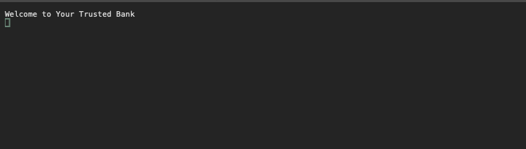

# Bank ATM Program

## Console Application

Lab: 02 - Unit Tests & Documentation

*Author: Ian Whitmore*

----

## Description

This is a C# console application that will present the user with a Bank ATM program that imitates the functionality of an ATM. Within this program the user can go through a series of prompts to check their available balance, withdraw money from their account, and deposit money to their account.

---

### Getting Started - How to use the Bank ATM

* To use the bank ATM first clone down this repository to your local machine.

* Next run this program using Visual Studio:

  * Select ```File``` --- ```Open``` --- ```Project/Solution```

* Next navigate to the location you cloned the Repository

* Double click on the ```Lab02-ATM``` directory

* Then select and open the program

* After the program is up, you should be able to follow the prompts to use the ATM machine!

---

### Visuals

#### Application Start



#### Using the Application


Real Image comeing soon!

#### Application End


Real Image coming soon!

---

### Additional Infomation

My [Github](https://github.com/iwhitmor) page
My [LinkedIn](https://www.linkedin.com/in/ianwhitmor/) page
